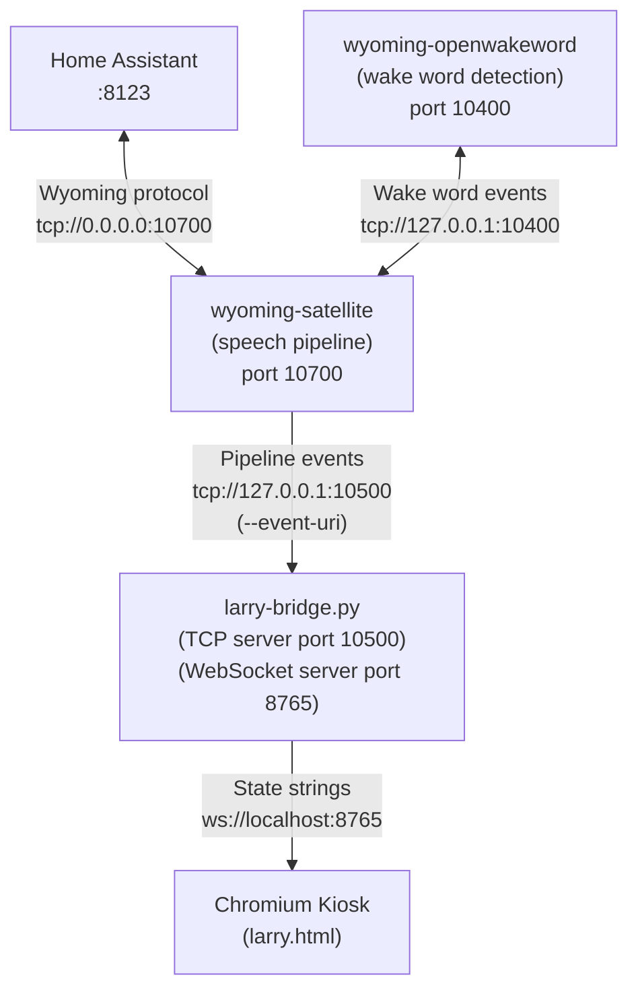
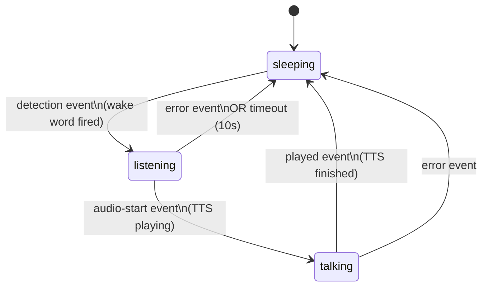

# Larry the Screensaver

Larry is a robot screensaver built in a single HTML file. He drifts around the screen to prevent burn-in, his sensors move slowly, and he occasionally uses his cybernetic eyes to run a retinal scan. He is also a reactive face for a Home Assistant voice assistant — his eyes and expression change in real time based on whether the assistant is sleeping, listening, or talking.

He was built for a Raspberry Pi 5 running a Home Assistant kiosk on a 10.1" touchscreen, but he'll run in any modern browser on any screen size.

---

## Table of Contents

- [System Architecture](#system-architecture)
- [How State Switching Works](#how-state-switching-works)
- [Files](#files)
- [Features](#features)
- [Setup From Scratch](#setup-from-scratch)
- [Configuration](#configuration)
- [Autostart Files](#autostart-files)
- [Services](#services)
- [Troubleshooting](#troubleshooting)
- [Testing Without Waiting for Idle](#testing-without-waiting-for-idle)
- [Updating Larry](#updating-larry)
- [Technical Notes](#technical-notes)
- [Browser Compatibility](#browser-compatibility)

---

## System Architecture

### Overview



### State Machine



---

## How State Switching Works

### End-to-End Flow

1. **Wake word fires** — `wyoming-openwakeword` detects "<wake word>" and signals `wyoming-satellite`
2. **Wyoming emits a `detection` event** — sent over the `--event-uri` TCP connection to `larry-bridge.py`
3. **larry-bridge broadcasts `"listening"`** — over WebSocket to `larry.html` in the browser
4. **Larry enters listening state** — eyes change color and size, arms lift, scan behavior changes
5. **User speaks** — `wyoming-satellite` streams audio to Home Assistant for STT
6. **HA processes and responds** — intent recognition, response generation, TTS
7. **Wyoming emits `audio-start`** — TTS audio is about to play through the speaker
8. **larry-bridge broadcasts `"talking"`** — Larry animates into talking state
9. **Wyoming emits `played`** — TTS audio finished
10. **larry-bridge broadcasts `"sleeping"`** — Larry returns to screensaver

### Wyoming Event → Larry State Mapping

| Wyoming Event | Larry State | Reason |
|---|---|---|
| `detection` | `listening` | Wake word confirmed |
| `streaming-started` | `listening` | Belt-and-suspenders fallback |
| `audio-start` | `talking` | TTS audio beginning |
| `played` | `sleeping` | TTS fully finished |
| `error` | `sleeping` | Pipeline failed — reset to idle |

### Timing and Edge Cases

**Listening timeout:** If `listening` never transitions to `talking` within 10 seconds (misfire, unrecognized speech, HA error), larry-bridge automatically resets to `sleeping`. This prevents Larry getting permanently stuck in listening state.

**Self-demo mode:** If the WebSocket isn't connected to larry-bridge, `larry.html` cycles through the three states automatically every 10 seconds so you can see the animations without a live bridge.

**Reconnect behavior:** larry-bridge reconnects to Wyoming's event stream automatically on disconnect. `larry.html` reconnects to the WebSocket every 5 seconds on close or error.

### WebSocket Protocol

larry-bridge sends plain text strings over WebSocket — no JSON, no framing. The three possible messages are exactly:

```
sleeping
listening
talking
```

`larry.html` reads `ws.onmessage` and calls `enterState(state)` when it receives one of these.

### Wyoming Event Format

`wyoming-satellite` sends newline-delimited JSON over the TCP event connection, but often concatenates multiple JSON objects on a single line:

```
{"type":"detection","version":"1.5.4","data_length":60}{"name":"<wake_word>","timestamp":946176}
```

larry-bridge handles this with a character-by-character brace-depth parser (`extract_json_objects()`) rather than a simple `json.loads()` call.

---

## Files

```
screensaver/
├── larry.html          # Larry's face — canvas-based robot, three states, WebSocket client
├── larry-bridge.py     # WebSocket server + Wyoming event TCP server (the bridge)
├── dashboard.html      # Home Assistant redirect page (used during kiosk transitions)
└── kiosk-controller.sh # Launches swayidle to trigger Larry after 300s idle

~/.config/autostart/
├── kiosk.desktop       # Launches Chromium → Home Assistant on boot
├── screensaver.desktop # Launches swayidle to trigger Larry screensaver
└── unclutter.desktop   # Hides mouse cursor after 3s idle

/etc/systemd/system/
├── wyoming-satellite.service   # Wyoming satellite (speech pipeline)
├── wyoming-openwakeword.service # Wake word detection
└── larry-bridge.service        # Larry's WebSocket/event bridge
```

---

## Features

### Screensaver (sleeping state)
- **Drifts around the screen** — bounces off all four edges using `getBoundingClientRect()` for pixel-accurate bounds, never stays still, no burn-in
- **Breathes** — subtle scale animation gives him a slow, steady inhale/exhale
- **Cybernetic eyes** — segmented iris rings rotate slowly clockwise at all times
- **Scan mode** — every few seconds the iris spins up, a scanline sweeps top to bottom, and the pupil dilates, then returns to idle
- **ZZZ bubbles** — three staggered Z's float upward from his head in sequence
- **Snore bubbles** — small circles pulse out from the corner of his mouth
- **Chest LEDs** — four lights blink independently on randomized timers
- **Activity bar** — a green bar on his chest pulses back and forth like a VU meter
- **Antenna pulse** — the tip of his antenna fades in and out
- **CRT scanline overlay** — a subtle full-screen scanline texture over everything

### Listening state
- Eyes open wide, pupils contract
- Different eye/iris color scheme
- Arms lift
- Scan behavior changes to indicate alertness

### Talking state
- Distinct eye animation indicating TTS playback
- Transitions automatically back to sleeping when audio finishes

### General
- **Tap to wake** — any click, touch, or keypress navigates to `WAKE_URL` (or closes the window)
- **"Tap to wake Larry" hint** — fades in and out at the bottom of the screen
- **Self-demo** — cycles through states automatically when no bridge is connected

---

## Setup From Scratch

### Prerequisites

- Raspberry Pi 5 (or any Pi running Pi OS Bookworm)
- Wayland compositor (labwc recommended)
- Home Assistant running on the network
- Wyoming satellite and openwakeword already installed and working

### 1. Install Wyoming Satellite Dependencies

```bash
cd ~/wyoming-satellite
python3 -m venv .venv
.venv/bin/pip install --upgrade pip wheel
.venv/bin/pip install wyoming==1.5.2
```

### 2. Install larry-bridge Dependencies

```bash
pip3 install websockets --break-system-packages
```

### 3. Copy Screensaver Files

```bash
mkdir -p ~/screensaver
# Copy larry.html, larry-bridge.py, dashboard.html, kiosk-controller.sh
# into ~/screensaver/
```

### 4. Configure Wyoming Satellite Service

Add `--event-uri` to the Wyoming satellite's ExecStart so it emits pipeline events to larry-bridge:

```bash
sudo tee /etc/systemd/system/wyoming-satellite.service << 'EOF'
[Unit]
Description=Wyoming Satellite
After=network.target wyoming-openwakeword.service

[Service]
Type=simple
User=<user>
ExecStart=/home/<user>/wyoming-satellite/.venv/bin/python3 \
  -m wyoming_satellite \
  --name "<hostname>" \
  --uri tcp://0.0.0.0:10700 \
  --mic-command "bash -c 'arecord -D hw:2,0 -r 16000 -c 6 -f S16_LE -t raw | sox -t raw -r 16000 -c 6 -e signed -b 16 - -t raw -r 16000 -c 1 -e signed -b 16 -'" \
  --snd-command "aplay -D plughw:3,0 -r 22050 -c 1 -f S16_LE -t raw" \
  --wake-uri tcp://127.0.0.1:10400 \
  --wake-word-name "<wake_word>" \
  --event-uri 'tcp://127.0.0.1:10500'
WorkingDirectory=/home/<user>/wyoming-satellite
Restart=always
RestartSec=5

[Install]
WantedBy=multi-user.target
EOF
```

> **Note:** Adjust `--mic-command`, `--snd-command`, `--wake-word-name`, and username to match your hardware and setup.

```bash
sudo systemctl daemon-reload
sudo systemctl restart wyoming-satellite
sudo systemctl status wyoming-satellite
```

### 5. Install larry-bridge Service

```bash
sudo tee /etc/systemd/system/larry-bridge.service << 'EOF'
[Unit]
Description=Larry WebSocket state bridge (Wyoming events -> browser face states)
After=network.target wyoming-satellite.service
Wants=wyoming-satellite.service

[Service]
Type=simple
User=<user>
ExecStart=/usr/bin/python3 /home/<user>/screensaver/larry-bridge.py
Restart=on-failure
RestartSec=3

[Install]
WantedBy=multi-user.target
EOF

sudo systemctl daemon-reload
sudo systemctl enable --now larry-bridge.service
sudo systemctl status larry-bridge.service
```

### 6. Configure Autostart Files

```bash
# Home Assistant kiosk — launches on boot
cat > ~/.config/autostart/kiosk.desktop << 'EOF'
[Desktop Entry]
Type=Application
Name=HA Kiosk
Exec=chromium --kiosk --noerrdialogs --disable-infobars --disable-session-crashed-bubble --disable-restore-session-state --check-for-update-interval=31536000 --password-store=basic --use-mock-keychain "http://<HA_IP>:8123?kiosk"
X-GNOME-Autostart-enabled=true
EOF

# Larry screensaver — triggers after 300s idle
cat > ~/.config/autostart/screensaver.desktop << 'EOF'
[Desktop Entry]
Type=Application
Name=Larry Screensaver
Exec=swayidle -w timeout 300 'WAYLAND_DISPLAY=wayland-1 chromium --kiosk --noerrdialogs file:///home/<user>/screensaver/larry.html'
X-GNOME-Autostart-enabled=true
EOF

# Hide mouse cursor after 3s
cat > ~/.config/autostart/unclutter.desktop << 'EOF'
[Desktop Entry]
Type=Application
Name=Unclutter
Exec=unclutter -idle 3
X-GNOME-Autostart-enabled=true
EOF
```

> **Note:** Replace `<HA_IP>:8123` with your actual Home Assistant IP and port.

### 7. Verify Everything

```bash
# Check all services are running
sudo systemctl status wyoming-openwakeword
sudo systemctl status wyoming-satellite
sudo systemctl status larry-bridge

# Watch larry-bridge live
journalctl -u larry-bridge -f --no-pager

# Say your wake word — you should see:
# [bridge] Wyoming event: detection
# [bridge] -> listening
```

---

## Configuration

All adjustable values live as `const` declarations at the top of the `<script>` block in `larry.html`.

```javascript
const LARRY_WIDTH       = Math.min(window.innerWidth * 0.30, window.innerHeight * 0.38);
const LARRY_HEIGHT      = LARRY_WIDTH * (320 / 260);
const SPEED_MIN         = 0.9;
const SPEED_MAX         = 1.4;
const SCAN_INTERVAL_MIN = 5000;
const SCAN_INTERVAL_MAX = 13000;
const SCAN_SPIN_SPEED   = 1.8;
const IDLE_SPIN_SPEED   = 0.045;
const SCAN_DURATION     = 2400;
const BG_COLOR          = '#0a0a0a';
const WAKE_URL          = '';
const WS_URL            = 'ws://localhost:8765';
const CYCLE_DURATION    = 10000;
```

### LARRY_WIDTH / LARRY_HEIGHT

Larry's size is calculated relative to the viewport so he fits any screen automatically.

| Size feel | Width multiplier | Height multiplier |
|---|---|---|
| Smaller | 0.22 | 0.28 |
| Default | 0.30 | 0.38 |
| Larger | 0.42 | 0.52 |

### SPEED_MIN / SPEED_MAX

Controls how fast Larry drifts in screensaver mode.

| Feel | speedMin | speedMax |
|---|---|---|
| Barely drifting | 0.2 | 0.4 |
| Calm float | 0.4 | 0.7 |
| Default | 0.9 | 1.4 |
| Energetic | 1.5 | 2.2 |
| Chaotic | 2.5 | 4.0 |

### SCAN_INTERVAL_MIN / SCAN_INTERVAL_MAX

How long Larry waits between eye scans (milliseconds).

| Feel | Min | Max |
|---|---|---|
| Constantly scanning | 1000 | 3000 |
| Frequent | 3000 | 6000 |
| Default | 5000 | 13000 |
| Rare | 15000 | 30000 |

### WAKE_URL

Where Larry navigates when tapped. If empty, calls `window.close()` instead.

```javascript
const WAKE_URL = '';                               // close the window (default)
const WAKE_URL = 'http://<HA_IP>:8123?kiosk'; // Home Assistant kiosk mode
```

### WS_URL

WebSocket URL for larry-bridge. Since the browser runs on the same Pi as larry-bridge, `localhost` is correct. Only change this if running the browser on a different machine.

```javascript
const WS_URL = 'ws://localhost:8765';        // browser on same Pi (default)
const WS_URL = 'ws://<PI_IP>:8765';   // browser on different machine
```

### CYCLE_DURATION

How long each state lasts during self-demo mode (when no bridge is connected), in milliseconds. Default: `10000` (10 seconds).

### BG_COLOR / Accent Color

`BG_COLOR` sets the background. The accent color (`#00ff46`) is set directly in the SVG markup. To recolor Larry, find-and-replace `#00ff46` in the file.

| Look | Value |
|---|---|
| Razer green (default) | `#00ff46` |
| Cyan / ice | `#00cfff` |
| Amber / warm | `#ffaa00` |
| Red alert | `#ff2200` |
| Purple | `#aa44ff` |

### larry-bridge.py Configuration

```python
WS_PORT             = 8765          # WebSocket port Larry's browser connects to
EVENT_HOST          = '127.0.0.1'   # Wyoming event TCP server bind address (keep local)
EVENT_PORT          = 10500         # Wyoming event TCP server bind port
LISTENING_TIMEOUT_S = 10.0          # Seconds before listening auto-resets to sleeping
```

---

## Autostart Files

All autostart files live in `~/.config/autostart/`. They are processed by `lxsession-xdg-autostart`, called by labwc on every boot.

### kiosk.desktop — launches Home Assistant

```ini
[Desktop Entry]
Type=Application
Name=HA Kiosk
Exec=chromium --kiosk --noerrdialogs --disable-infobars --disable-session-crashed-bubble --disable-restore-session-state --check-for-update-interval=31536000 --password-store=basic --use-mock-keychain "http://<HA_IP>:8123?kiosk"
X-GNOME-Autostart-enabled=true
```

### screensaver.desktop — triggers Larry after idle

```ini
[Desktop Entry]
Type=Application
Name=Larry Screensaver
Exec=swayidle -w timeout 300 'WAYLAND_DISPLAY=wayland-1 chromium --kiosk --noerrdialogs file:///home/<user>/screensaver/larry.html'
X-GNOME-Autostart-enabled=true
```

> **Note:** `WAYLAND_DISPLAY=wayland-1` is required because swayidle runs before the display variable is exported to its child processes.

> **Note:** There is no `resume` action. swayidle resets its own timer automatically when input is detected.

### unclutter.desktop — hides mouse cursor

```ini
[Desktop Entry]
Type=Application
Name=Unclutter
Exec=unclutter -idle 3
X-GNOME-Autostart-enabled=true
```

---

## Services

### wyoming-satellite.service

Runs the Wyoming satellite — handles the full voice pipeline: mic capture, wake word detection handoff, STT streaming to HA, TTS playback. The critical flag for Larry is `--event-uri 'tcp://127.0.0.1:10500'` which tells it to connect to larry-bridge and stream pipeline events.

```bash
sudo systemctl status wyoming-satellite
sudo systemctl restart wyoming-satellite
journalctl -u wyoming-satellite -f --no-pager
```

### wyoming-openwakeword.service

Runs wake word detection. Listens on port 10400, wyoming-satellite connects to it.

```bash
sudo systemctl status wyoming-openwakeword
journalctl -u wyoming-openwakeword -f --no-pager
```

### larry-bridge.service

Runs larry-bridge.py. Listens on two ports simultaneously:
- **TCP 10500** — wyoming-satellite connects here and pushes pipeline events
- **WebSocket 8765** — larry.html connects here and receives state strings

```bash
sudo systemctl status larry-bridge
sudo systemctl restart larry-bridge
journalctl -u larry-bridge -f --no-pager
```

---

## Troubleshooting

### Larry stays on sleeping state

**Step 1 — verify larry-bridge is running:**
```bash
sudo systemctl status larry-bridge
```

**Step 2 — check Wyoming has --event-uri set:**
```bash
sudo systemctl cat wyoming-satellite.service | grep event-uri
```
Should show: `--event-uri 'tcp://127.0.0.1:10500'`

**Step 3 — confirm Wyoming is connecting to larry-bridge:**
```bash
ss -tnp | grep 10500
```
Should show an established connection. If nothing appears, Wyoming isn't connecting to the event port.

**Step 4 — watch events live:**
```bash
journalctl -u larry-bridge -f --no-pager
```
Say your wake word. You should see:
```
[bridge] Wyoming satellite connected from ('127.0.0.1', ...)
[bridge] Wyoming event: detection
[bridge] -> listening
```

**Step 5 — raw event test:**
```bash
# Stop larry-bridge first so the port is free
sudo systemctl stop larry-bridge
# Listen on the port directly
nc -l 10500
# Restart Wyoming so it reconnects
sudo systemctl restart wyoming-satellite
# Say your wake word — raw JSON should appear
```

### Wyoming connects but no events fire on wake word

Check the actual wyoming-satellite logs while saying the wake word:
```bash
journalctl -u wyoming-satellite -f --no-pager
```
If you see `Waiting for wake word` but nothing after saying it, the wake word model may not be detecting correctly. Verify with wyoming-openwakeword directly.

### Larry goes to listening but never talking

This means Wyoming detected the wake word and processed speech, but Home Assistant isn't returning a TTS response. Check:
```bash
journalctl -u wyoming-satellite -f --no-pager
```
Common error: `intent-failed` — Home Assistant's conversation agent is failing. Check the conversation agent configured in HA → Settings → Voice Assistants.

### Port already in use on startup

```bash
# Find what's using port 8765 or 10500
ss -tlnp | grep 8765
ss -tlnp | grep 10500

# Usually means a previous larry-bridge instance is still running
sudo systemctl stop larry-bridge
# Then start fresh
sudo systemctl start larry-bridge
```

### "Site can't be reached" in kiosk

The HA URL in `kiosk.desktop` is wrong. Find and fix it:
```bash
grep -ri "192.168\|8123" ~/.config/autostart/
# Edit the offending file
nano ~/.config/autostart/kiosk.desktop
# Then reboot
sudo reboot
```

### Kiosk not launching / screensaver not appearing

Check autostart files are correct:
```bash
cat ~/.config/autostart/kiosk.desktop
cat ~/.config/autostart/screensaver.desktop
```

Verify `kiosk-controller.sh` exists and is executable:
```bash
ls -la ~/screensaver/kiosk-controller.sh
chmod +x ~/screensaver/kiosk-controller.sh
```

Apply autostart changes without rebooting:
```bash
systemctl --user restart lxsession-xdg-autostart
```

### Diagnosing the JSON parsing issue

Wyoming satellite concatenates multiple JSON objects on a single line. If you see `Non-JSON line:` in larry-bridge logs followed by what looks like two JSON objects joined together, the parser is working correctly — it splits them automatically. If events aren't being recognized, print the raw line and check the `type` field matches what's in `EVENT_STATE_MAP`.

---

## Screensaver Timeout

The idle timeout is set in `screensaver.desktop`. Change the `300` to the number of seconds you want:

| Timeout | Value |
|---|---|
| 2 minutes | 120 |
| 5 minutes (default) | 300 |
| 10 minutes | 600 |
| 30 minutes | 1800 |

After editing, apply with:
```bash
systemctl --user restart lxsession-xdg-autostart
# or just reboot
sudo reboot
```

---

## Testing Without Waiting for Idle

Launch Larry directly from SSH:
```bash
DISPLAY=:0 WAYLAND_DISPLAY=wayland-1 chromium --kiosk --noerrdialogs file:///home/<user>/screensaver/larry.html
```

Test larry-bridge manually (stop the service first):
```bash
sudo systemctl stop larry-bridge
python3 ~/screensaver/larry-bridge.py
# Watch console output, say wake word
```

Verify raw Wyoming events are flowing:
```bash
# With larry-bridge stopped
nc -l 127.0.0.1 10500
sudo systemctl restart wyoming-satellite
# Say wake word — JSON lines should appear
```

---

## Updating Larry

Edit on the Pi directly:
```bash
nano ~/screensaver/larry.html
```

---

## Technical Notes

- **No burn-in risk** — Larry never stays in one place. Bounce uses `getBoundingClientRect()` for true pixel-accurate edges including glow filter overflow.
- **Frame-rate independent** — all animation timings use `dt` (delta time between frames) so Larry moves and scans at the same speed at 30fps or 60fps.
- **No flicker** — all strokes are minimum `1.5px`. All dynamic animations use `requestAnimationFrame`, not SVG `<animate>`.
- **Self-contained** — one HTML file, no external requests, safe to run fully offline.
- **Wayland compatible** — runs inside Chromium under labwc. `swayidle` handles idle detection at the compositor level.
- **TTY session** — the Pi boots to a TTY, not a full desktop. XDG autostart files are processed by `lxsession-xdg-autostart` via labwc.
- **window.close()** — Larry closes himself on any tap, click, or keypress. This works in a Chromium kiosk window opened by swayidle as a child process.
- **WebSocket reconnect** — `larry.html` reconnects every 5 seconds on close or error. larry-bridge sends the current state immediately on each new connection so Larry is always in sync.
- **sudo and redirection** — `sudo command > file` doesn't work because the shell opens the file before sudo runs. Use `sudo tee file << 'EOF'` instead.

---

## Browser Compatibility

Larry uses standard SVG and vanilla JS. He works in any modern browser. Specifically tested on Chromium on Pi OS Bookworm (labwc/Wayland).

| Browser | Status |
|---|---|
| Chromium (Pi OS, Windows, macOS) | ✅ Tested |
| Firefox | ✅ Compatible |
| Safari | ✅ Compatible |
| Edge | ✅ Compatible |
